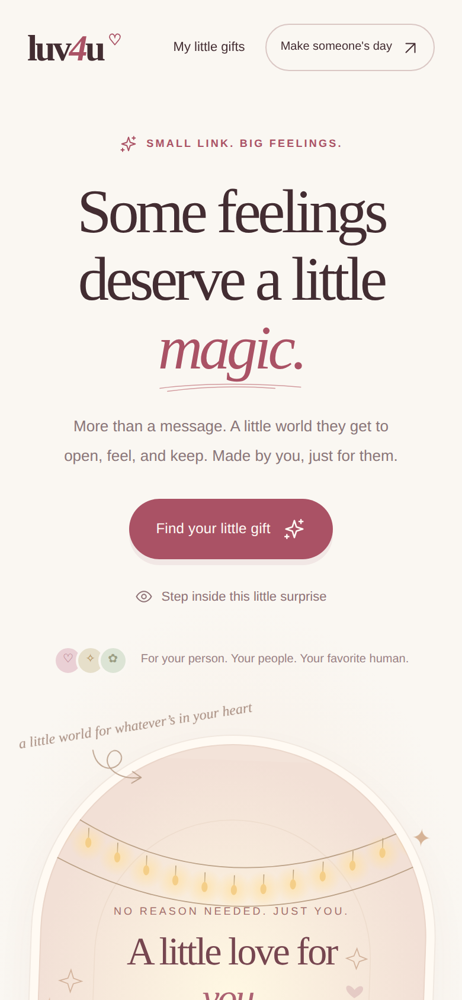
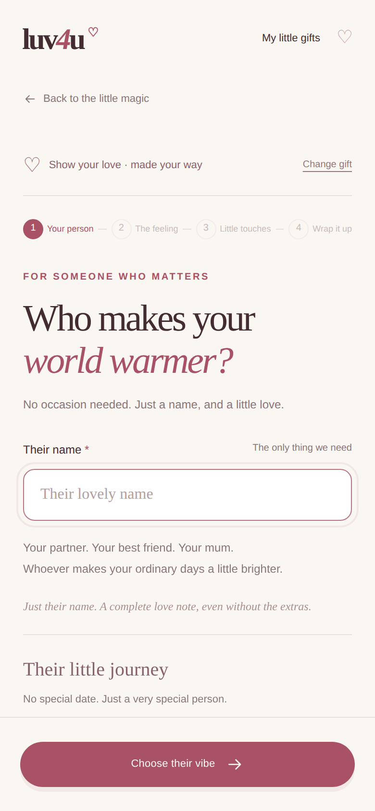
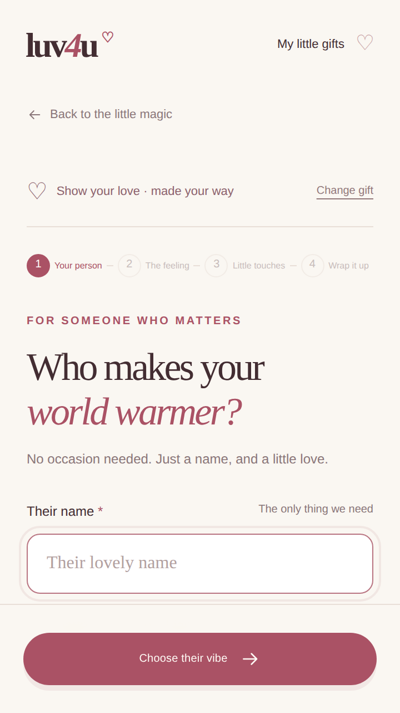
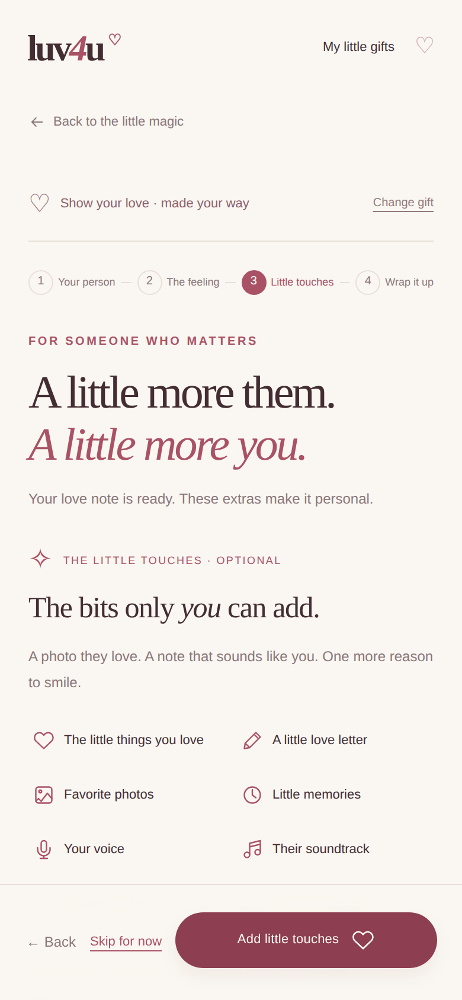
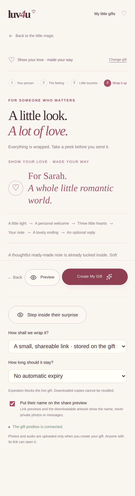
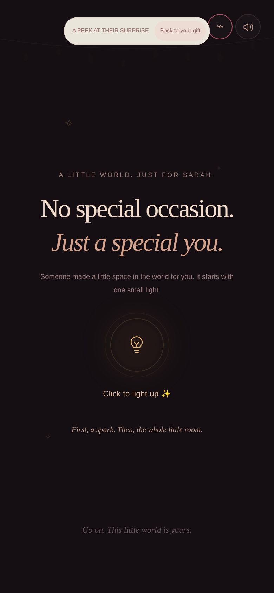
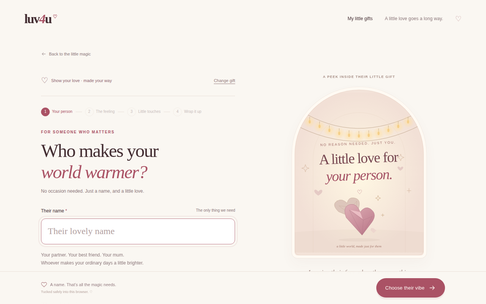

# UX audit: creator flow (task 1a)

Goal: find what stops people from finishing a gift, and turn each finding into something we can measure and fix.

## How this was done

- Walked the real production build on a phone (390×844, touch, iPhone user agent), a small phone (360×640) and a desktop (1280×800), from the landing page to the full-screen preview, capturing every step.
- Measured each screen with scripts: tap-target sizes, text sizes, page height, control counts, page weight, and automated accessibility checks (axe-core, WCAG 2 A/AA).
- Reviewed each screen against usability heuristics (clarity, effort, feedback, error prevention, consistency).

**Limits, stated plainly:** this is an expert review plus measurements, not user research. It ran against a local build with a mock database and no network throttling, so timings are optimistic. Nothing here shows what real users do. The funnel events shipped in task 0 and the usability sessions below are how we find out. Treat the "hypotheses" as things to test, not facts.

## Screens reviewed

| | |
| --- | --- |
| Landing (phone) |  |
| Step 1: name (phone) |  |
| Step 1: name (360×640 phone) |  |
| Step 3: touches choice (phone) |  |
| Step 4: wrap up (phone) |  |
| Full-screen preview (phone) |  |
| Step 1: name (desktop) |  |

## Numbers

| Measure | Result |
| --- | --- |
| Minimum path to a preview (name only) | Type a name, then 4 taps (*Choose their vibe → Next: little touches → Skip for now → Preview*), then *Create My Gift* |
| Landing page height on a phone | about 6,000 px (roughly 7 screens); the gift chooser starts about 1,100 px down on a 640 px phone |
| Creator step 3 on a phone | 2,372 px tall, 63 controls, 86 text elements under 12 px |
| Text under 12 px | 41 elements on the landing page, 16–86 per creator screen |
| Controls under 44 px (tap size) | 7–16 per creator screen (back link 131×30, stepper, "Change gift", text links) |
| Automated accessibility | 1 serious rule fails everywhere: colour contrast (35 nodes on the landing page, 7–24 per creator screen) |
| Page weight | HTML 28 KB, JS 220 KB, CSS 22 KB, 12 requests. Fast locally; needs a throttled mid-range Android run |

## Funnel and hypotheses

Events from task 0 already measure each step (`supabase/queries/funnel.sql`).

| Stage | Event | Hypothesis to test | Signal |
| --- | --- | --- | --- |
| Arrive | `page_view` | Visitors from `/for/*` pages start with intent; home visitors browse | Bounce and start rate by landing path |
| Choose an occasion | `occasion_selected` | The hero button only scrolls, so some visitors never find the chooser | `page_view` → `occasion_selected` on the home page |
| Open the creator | `creator_opened` | A drop happens between choosing an occasion and typing a name | `occasion_selected` → `creator_opened` |
| Name and vibe | `wizard_next` (`label`) | Two screens for two low-effort choices cost people | Which `label` is the last one seen |
| Little touches | `wizard_next` | The touches screen is where people stall or abandon | Share of sessions that stop after "Add little touches" |
| Publish | `publish_clicked` → `gift_published` | Today's step 4 is confusing and may cause errors | Ratio of clicks to publishes |
| Share | `link_copied`, `whatsapp_clicked`, `download_clicked` | Most people share by WhatsApp | Which action follows publishing |
| Recipient | `gift_opened` → `reply_sent` | Recipients who open rarely reply | Reply rate per occasion |

## Findings, most important first

Severity: **High** = likely costs completions; **Medium** = hurts clarity or trust; **Low** = polish. "Verified" means seen in the screenshots or measured; "Hypothesis" needs testing.

### High

**F1. The main button does not start anything.** *Verified.* "Find your little gift" only scrolls down to the chooser (the page did not change after clicking). The user then picks one of eight cards ("Make this little gift"), and the header also offers "Make someone's day". Three labels for one action, and on a phone the chooser is about two screens below.
→ Show the eight occasions (chips or a compact grid) in the first screen; make the hero button open the chooser directly; use one label for the action.

**F2. On phones there is no live preview while creating, and on desktop it barely reflects your input.** *Verified.* The preview pane shows a generic illustration with the name; it doesn't show the typed message, the chosen mood, or photos. The real preview is a separate full-screen mode, reached from two different buttons on the last step ("Preview" and "Step inside their surprise"). People are more likely to finish when they see their own gift taking shape.
→ A preview that updates as they type (a compact card on phones, a side panel on desktop), with one clear "Preview full screen" button.

**F3. The "Little touches" step is overloaded.** *Verified.* Step 3 opens with a separate "Add little touches / Skip for now" decision, then shows seven collapsed sections, three long suggested letters expanded by default, and a phone-number field ("Country code + number") inside the letter section. On a phone that is a 2,372 px screen.
→ Skip the extra decision. Lead with the two touches people value most (a photo and a voice note), put the rest under "More", collapse suggested wording behind one "Suggest words" button, and move the reply phone number to the share step.

**F4. Colour contrast fails, and text is small.** *Verified.* The shared grey (`#8a7679` on `#faf7f2`) is 3.97:1 where 4.5:1 is required, and it is used at 9–13 px. Lighter greys reach only 2.78–2.99:1. This affects the stepper labels, hints, card descriptions and the footer.
→ Darken the muted colour to about 6:1, raise the smallest text to at least 12–13 px, and fix it once in the design tokens (task 2a).

### Medium

**F5. Four steps for a gift that needs one name.** *Verified.* Name, vibe, touches and wrap are four screens; the vibe is a preference most people won't have strong feelings about.
→ Collapse to two steps: (1) name plus mood, with the live preview, and (2) optional words and photos, then preview and pay. Default the mood per occasion.

**F6. The last step shows internal settings and jargon.** *Verified.* "How shall we wrap it? — A small, shareable link · stored on the gift server" (truncated in the dropdown), "No automatic expiry", "The gift postbox is connected". These describe how the system works, not what the user wants.
→ Sensible defaults, plain language, and one collapsed "More options" section. This is also where the price and pay button will sit.

**F7. Top of the phone screen is crowded before the first field.** *Verified.* Header, "Back to the little magic", the gift ribbon with "Change gift", the four-step tracker, an eyebrow, a headline and a sub-line come before the name field (which begins about 480 px down on a 640 px phone). With the keyboard open the field may need scrolling. *(Keyboard behaviour: hypothesis, test on a real device.)*
→ Put the field first; shrink or remove the ribbon and the tracker on phones.

**F8. Tap targets are too small.** *Verified.* 7–16 controls on each creator screen are under 44 px: the back link is 131×30, several buttons are about 35–40 px tall, and the preview's round buttons are 36×36.
→ 44×44 px minimum for anything tappable.

**F9. The full-screen preview's top bar is cramped.** *Verified.* The "A peek at their surprise / Back to your gift" pill touches the two round icon buttons (motion and sound), and those two have no text labels.
→ Give the bar room, label the icons, and make "Back to editing" the most obvious control.

**F10. Vocabulary is charming but sometimes unclear.** *Hypothesis.* "Vibe", "little touches", "wrap it up", "their little journey", "postbox". First-time visitors may not know what the next step does.
→ Plain primary labels ("Choose a mood", "Add a photo or voice note", "Preview") with the warm phrasing as secondary text. Test in the usability sessions.

**F11. The paywall has no natural home yet.** *Product.* Today "Create My Gift" publishes immediately. Payments (tasks 8 and 9) need a screen after the full preview that says what they get, the price, and one button.
→ Design the step-2 layout with that moment in mind: preview above, price and pay below.

### Low

**F12. Landing page is long.** About 6,000 px on a phone; the chooser starts about two screens down. → Covered by F1; add a short "how it works" and move the eight-card grid up.

**F13. The new SEO content sits outside a page landmark** (axe "region" rule, 1 node). *Verified.* → Wrap it in a labelled section. A five-minute fix.

**F14. Page weight needs a real-device check.** Local numbers are fine (JS 220 KB, load ~215 ms), but they exclude network throttling and parse time on a low-end phone. → Run Lighthouse in mobile mode and test one budget Android phone before promoting the site.

## What is already good (keep)

- One required field; a name alone makes a complete gift.
- "Skip for now" never erases what was already added.
- Warm, distinctive visual identity and illustrations; the recipient's "Click to light up" opening is a memorable moment.
- Consistent step tracker and a persistent bottom action bar with Back / Preview / Next.
- Autosaved drafts ("Tucked safely into this browser").

## Recommended fix order

1. **Quick wins (a day):** F4 contrast tokens and minimum text size, F8 tap targets, F13 landmark, F9 preview bar spacing.
2. **Creator redesign (task 1b):** F1, F2, F3, F5, F6, F7, F10, with F11 in mind.
3. **Re-measure:** run the funnel query and the sessions below before and after.

## Usability test script (5 moderated sessions, about 25 minutes each)

**Who:** 5 people who gave someone a birthday, anniversary or apology gift in the last six months; mix of phone and laptop; not friends of the team. Test on their own phone where possible.

**Set-up:** they share their screen (or you watch over their shoulder). Say: "We're testing the site, not you. Please think aloud. Nothing you do can be wrong."

**Warm-up (3 min):** "Tell me about the last gift you gave someone you care about. How did you choose it? What did you wish it could do?"

**Task 1: first impression (2 min).** Show the landing page for 5 seconds, then hide it. "What is this site? Who is it for? What would you do here?"

**Task 2: start a gift (5 min).** "Imagine it's your friend Sam's birthday tomorrow. Make Sam a gift here." Do not help. Note where they hesitate, what they click first, and the words they use.

**Task 3: make it personal (5 min).** "Add something that only you could add." Watch whether they find photos, voice or a message; how they react to suggested wording.

**Task 4: preview and decide (4 min).** "Show me what Sam will see. Would you send this? What would you change?" Ask what they expect to happen next and, for a paid product, "What would you expect to pay for this? At what price would it feel too expensive, and too cheap?"

**Task 5: share (3 min).** "Send it to Sam as you normally would." Note WhatsApp, copy link or download.

**Wrap-up (3 min):** "What was the best part? The most confusing part? Would you use it again, and for what?"

**Record for each session**

| Item | Notes |
| --- | --- |
| Device and browser | |
| Time to first preview | |
| Where they hesitated (screen, seconds, quote) | |
| Wrong turns or errors | |
| Words they used for things (mood, touches, wrap) | |
| Finished and sent? | |
| Would pay? Expected price range | |

**Success looks like:** at least 4 of 5 reach a preview without help in under 3 minutes, at least 4 of 5 say they would send it, and no screen produces the same confusion in 3 or more sessions. Any issue that hits 3 of 5 goes to the top of task 1b.

**Recruiting tip:** pay participants with a coffee-voucher-sized thank-you and ask about their real gift plans; avoid asking leading questions such as "Did you like the animation?"

## After the redesign (task 1b)

Re-measured with the same scripts on the same phone (390×844). "Before" is the audit above.

| Measure | Before | After |
| --- | --- | --- |
| Steps in the creator | 4, plus an extra "add or skip" screen | **3** (name + mood together; no add-or-skip screen) |
| Occasions reachable from the first screen | 0 (main button only scrolled) | **8 chips in the first screen** |
| Colour-contrast failures (axe) | 35 on landing, 7–24 per creator step | **0** on landing and every creator step, enforced in the e2e test |
| Text under 12 px | 41 on landing, 16–86 per creator screen | **8 on landing, 2–15 per creator screen** (what remains is small print and art) |
| Controls under 44 px | 9 landing, 7–16 per creator screen | **1 landing, 0–2 per creator screen** (the invisible skip link; two checkboxes whose whole label row is tappable; one 40 px text link) |
| Words & photos step height | 2,372 px, 63 controls | **1,624 px, 52 controls** (with the note open) |
| Horizontal scroll on phone | none | none (the new 3-step tracker was checked for overflow) |
| Preview buttons on one screen | 2–3 | **1** |
| Internal wording ("gift postbox", "stored on the gift server") | shown | **removed** |
| Phone number field | inside the letter section | **under More options on the last step** |

### What changed, by finding

| Finding | What shipped |
| --- | --- |
| F1 main button only scrolls | Occasion chips in the first screen; one label ("Choose a gift" / "Make a gift") for the action |
| F2 no live preview | Compact live card on phones (name, mood, note excerpt, first photo) on step 2; desktop keeps the side preview. **Not yet done:** the desktop side preview still shows a generic illustration that only reflects the name |
| F3 touches overload | No add-or-skip screen; note open on arrival; suggestions collapsed; memories/soundtrack/games/final under "More"; phone number moved |
| F4 contrast and text size | Darker muted colour and text greys (text only), 12 px minimum in the creator and landing UI, guarded by an automated check |
| F5 four steps | Name and mood on one screen; three steps in total |
| F6 jargon | "Link type", "Keep the link live for", "Show their name in link previews", all under a collapsed "More options" |
| F7 crowded phone header | Eyebrow hidden and spacing tightened on phones; the step tracker shows only the current step's name |
| F8 tap targets | 44 px minimum on links, buttons, steps, pills and the round preview controls |
| F9 preview bar | "Back to editing" is a clear 44 px button on the left; controls no longer collide |
| F10 vocabulary | "Name & mood", "Words & photos", "Preview & send", "Pick a mood". The warm phrasing stays in headings and captions. Still to validate with real users |
| F13 landmark | SEO content is now a labelled region |

### Still open

- F11: the paywall moment (tasks 8 and 9). Step 3 is laid out to hold a price and pay button under the preview.
- Desktop side preview: reflect the typed note and first photo.
- The real usability sessions above, especially the "would you pay, and how much" questions.
- Real-device checks (keyboard behaviour with the name field on small phones; performance on a budget Android phone).

## Journey audit: duplicate actions (second pass)

Rule applied: one screen, one way forward per job. Each duplicate found, and what replaced it:

| Screen | Was | Now |
| --- | --- | --- |
| Creator dock, steps 1–2 | "Preview" next to "Preview & send" (which was really "next step") | Only "Next: …". "Preview" appears on step 3, where previewing is the job |
| Creator, mood | "No special date…" repeated under the moods, in the journey box and in the heading | Said once. The mood label now says what it does: "Sets the colours, words and music" |
| Share screen, sending | Copy link, WhatsApp, "Share the surprise", "Share artwork" | Copy link and WhatsApp; one "More apps" for other apps; one "Save this picture" with a line saying what it is |
| Share screen, private key | "Copy private recovery link", "Save recovery file", "My little gifts" (also in the header) | One "Copy my private edit link" |
| Recipient reply (hosted gifts) | "Wrap up my reply", then WhatsApp, Copy, "Send directly", plus a native Share | One "Send my reply", then a calm "Sent" state |
| Recipient reply (standalone file) | "Wrap up my reply", then share, WhatsApp and copy | One best send button (WhatsApp if the sender left a number, else Share, else Copy) and "or copy it instead" |

Still open: the landing page offers the occasion three ways (hero chips, the eight cards lower down, the footer links). The cards and links exist for search engines, so they stay, but the hero picker is the main path.

### Mood, and photos that get missed (third pass)

- **Does mood matter?** Measured by opening the same gift with four moods and comparing every scene. For a **birthday** it rewrites every scene's wording. For love, proposal and anniversary it changes **no words**: only an accent colour, the room's little decorations and the music's pitch (anniversary shows no visible colour change either). So for every occasion except birthday it is now offered as a **look** ("Pick a look · Sets the colours and soft sounds") with colour swatches, instead of six cards implying different writing. Birthday keeps "Pick a mood · Sets the words, colours and music". Real per-occasion moods would need new writing for each of the six moods in seven occasions; that is a content project, not a UI fix.
- **Photos and voice note were easy to miss.** They sat in folded sections. Now: the photo section is open when step 2 opens; the note, photos and voice rows each carry a plain status ("✓ 2 photos", "Not added yet"); and leaving step 2 with no photo and no voice note asks once, "Add something only you have?", with *Add a photo*, *Add a voice note*, or *Continue with words only*. Skipping is now a visible choice, and it is not asked twice.
- **Bug found and fixed:** the earlier change meant to hide "Preview" on steps 1 and 2 was overridden by older code that re-showed it whenever a name existed. It now really appears only on step 3.
- The photo upload box was 9–11px grey on cream (failing contrast, never tested while folded). It is now a clear, larger target.
